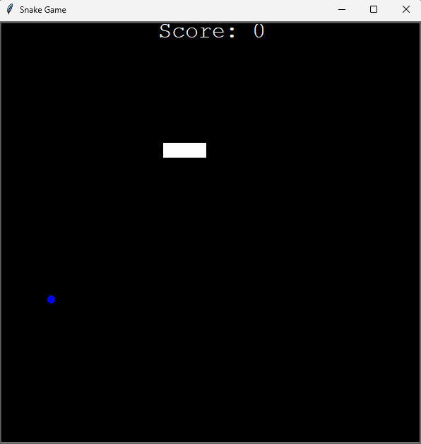

# Snake Game

A classic Snake Game built using Python and the Turtle graphics module.  
This project was developed as part of the **"100 Days of Code: The Complete Python Pro Bootcamp"** Udemy course.

## Features

- Classic snake gameplay (move, eat food, grow, avoid collisions)
- Score tracking
- Game over detection
- Modular code structure using Python classes

## Demo




## Technologies Used

- Python 3
- Turtle module (built-in)

## How to Run

1. Clone the repository:

```bash
git clone https://github.com/YOUR_USERNAME/snake-game.git
cd snake-game